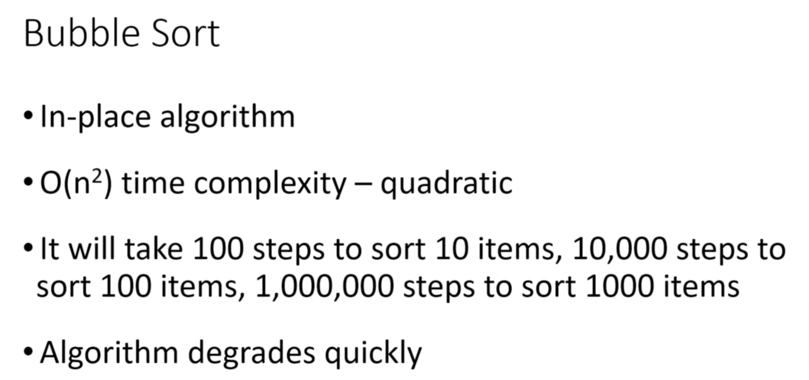

# Bubble Sort



## BubbleSort.java

```java
import java.util.Arrays;

public class BubbleSort {
    public static void main(String[] args) {
        int[] arr = {12, 4, 5, 7, 9, 20, 30, 6, 15};
        System.out.println("Array elements before sorting ");
        Arrays.stream(arr).forEach(val -> System.out.print(val + " "));
        bubbleSort(arr);
        System.out.println("\nArray elements after sorting ");
        Arrays.stream(arr).forEach(val -> System.out.print(val + " "));
    }

    private static void bubbleSort(int[] arr) {
        int n = arr.length;
        for (int i = 0; i < n - 1; i++) {
            for (int j = 0; j < n - i - 1; j++) {
                if (arr[j] > arr[j + 1]) {
                    swap(arr, j, j+1);
                }
            }
        }
    }

    private static void swap(int arr[], int i, int j) {
        if(i == j) return;
        int temp = arr[i];
        arr[i] = arr[j];
        arr[j] = temp;
    }
}
```
