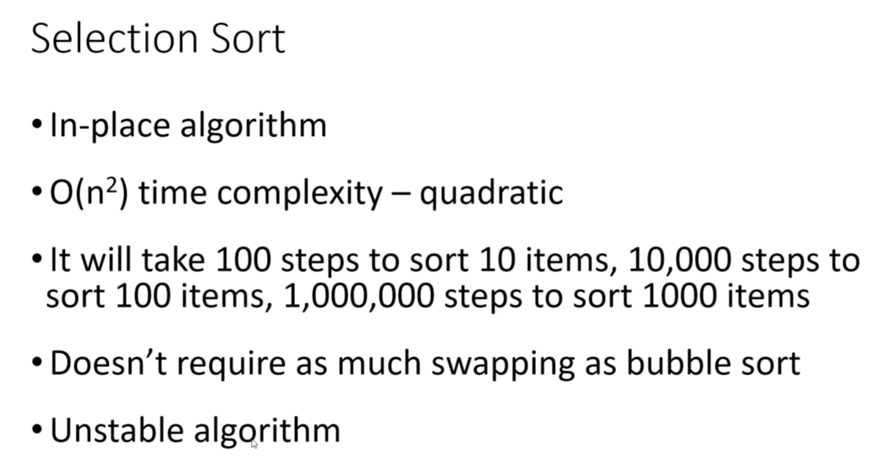

# Selection Sort

Selection sorting is a sorting algorithm where we select the minimum element from the array and put that at its correct position.



### Time Complexity

- Best: O(n^2)
- Average: O(n^2)
- Worst: O(n^2)

### Space Complexity

* O(1)

## SelectionSort.java

```java
package com.ranga.sort;

import java.util.Arrays;

public class SelectionSort {
    public static void main(String[] args) {
        int[] arr = {12, 4, 5, 7, 9, 20, 30, 6, 15};
        System.out.println("Array elements before sorting ");
        Arrays.stream(arr).forEach(val -> System.out.print(val + " "));
        selectionSort(arr);
        System.out.println("\nArray elements after sorting ");
        Arrays.stream(arr).forEach(val -> System.out.print(val + " "));
    }

    private static void selectionSort(int[] arr) {
        int n = arr.length;
        for (int i = 0; i < n - 1; i++) {
            int min_index = i;
            for (int j = i + 1; j < n; j++) {
                if (arr[j] < arr[min_index]) {
                    min_index = j;   // searching for minimum index
                }
            }
            swap(arr, min_index, i); // swap the array
        }
    }

    private static void swap(int[] arr, int i, int j) {
        if (i == j) return;
        int temp = arr[i];
        arr[i] = arr[j];
        arr[j] = temp;
    }
}
```
